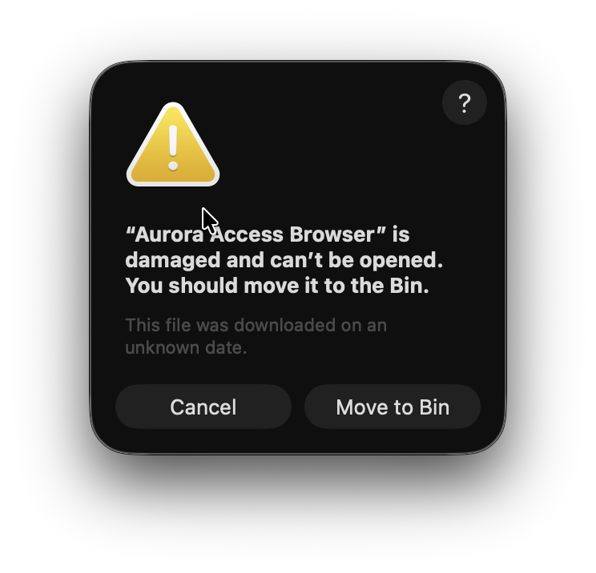

# ✦ Aurora Access Browser

[](https://github.com/AuroraAccess/aurora-access-browser)
[](https://github.com/AuroraAccess/aurora-access-browser)
[](https://github.com/AuroraAccess/aurora-access-browser)

**Aurora Access Browser** (v1.0.0) is a specialized, security-hardened gateway built for professional environments that require native integration with **RCF (Remote Chipset Functionality)** hardware bridges. It combines extreme minimalist aesthetics with deep-level sentinel monitoring.

---

## 📥 Download & Install

The official releases for **macOS (Silicon/Intel)** and **Windows (x64/Portable)** are available directly on our GitHub Releases page. 

> [!TIP]
> **[Go to Latest Releases](https://github.com/AuroraAccess/aurora-access-browser/releases)**
> 
> *Choose the `.dmg` (for Mac) or `.exe`/`Portable` (for Windows) to get started immediately.*


---

## 🛠️ macOS Troubleshooting (Damaged File)

If you see a message saying **"Aurora Access Browser is damaged and can't be opened"**, this is a known macOS Gatekeeper behavior for apps from sources other than the App Store.



To fix this, open your **Terminal** and run:

```bash
sudo xattr -cr /Applications/Aurora\ Access\ Browser.app
```

*After running this command, you will be able to open the application normally.*

---

## ⚡ Core Features

### 🛡️ Sentinel Security Gateway
Real-time "instinct" monitoring and threat detection at the system level. 
- **Silicon-Validated**: Built-in bios-level checks and biometrics pulse.
- **HTTPS Strict**: Force-blocks all unsecured connections by default.
- **Sentinel Defense**: Active withdrawal from network probes and automated response reflexes.

### 🔌 Native RCF Integration
Built with first-class support for the **RCF Hardware Protocol**.
- **Firmware Panel**: direct management of connected RCF devices (`aurora://rcf`).
- **Cryptographic Vault**: Hardware-isolated storage for keys and sensitive data (`aurora://vault`).

### 🌌 Immersive UI Concept
- **Stealth Design**: Minimalist, edge-to-edge layout with glass-morphism effects.
- **Smart Tabs**: Unified support for both advanced internal security tools and standard web targets.
- **Stealth Tabs**: Smooth integration of window controls and toolbars without visual clutter.

---

## 🏗️ Architecture & Protocols
- **Engine**: Electron + React + Vite.
- **Protocols**: Native support for `aurora://` and `rcf://` internal schemes.
- **Languages**: RU / EN / AZ.


---

## ⚖️ License
Copyright © 2026 **Aurora Access**. All rights reserved.
Specialized browser for use in the protected Aurora Access environment.
