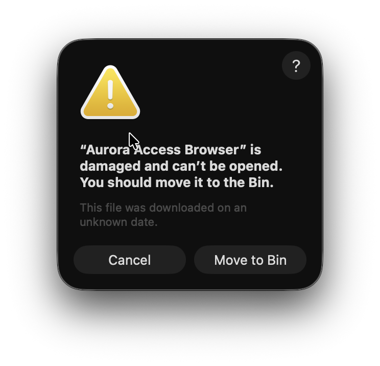

# ✦ Aurora Access Browser

[](https://github.com/AuroraAccess/aurora-access-browser)
[](https://github.com/AuroraAccess/aurora-access-browser)
[](https://github.com/AuroraAccess/aurora-access-browser)

**Aurora Access Browser** is a specialized, security-hardened gateway built for professional environments that require native integration with **RCF (Restricted Correlation Framework)** hardware bridges. It combines extreme minimalist aesthetics with deep-level sentinel monitoring.

RCF-PL v2.1.8 is **open source and free** — no license keys required.

---

## 📥 Download & Install

The official releases for **macOS (Silicon/Intel)** and **Windows (x64/Portable)** are available directly on our GitHub Releases page. 

> [!TIP]
> **[Go to Latest Releases](https://github.com/AuroraAccess/aurora-access-browser/releases)**
> 
> *Choose the `.dmg` (for Mac) or `.exe`/`Portable` (for Windows) to get started immediately.*


---

## 🛠️ macOS Troubleshooting (Damaged File)

If you see a message saying **"Aurora Access Browser is damaged and can't be opened"**, this is a known macOS Gatekeeper behavior for apps from sources other than the App Store.



To fix this, open your **Terminal** and run:

```bash
sudo xattr -cr /Applications/Aurora\ Access\ Browser.app
```

*After running this command, you will be able to open the application normally.*

---

## ⚡ Core Features

### 🛡️ Real Security, Real Data
Everything shown in the UI is measured, not simulated.
- **Strict HTTPS**: Cleartext HTTP is blocked and TLS certificate errors fail hard — no bypass.
- **Security Center**: Live CPU/RAM telemetry, vault status and active protection layers (all real data from the OS).
- **Tracker Blocking**: Known tracking/ad domains (Disconnect-style list) are actually cancelled via `webRequest`, with per-domain counters.
- **Permission Gate**: Geolocation, camera, microphone, notifications and other sensitive permissions are denied for external sites.
- **Sandboxed**: Renderer sandbox enabled, context isolation on, hardened `will-attach-webview`.

### 📊 Traffic Monitor
See what really leaves your machine: per-site request counts, top-blocked trackers and a live feed of recently blocked requests — all from real traffic this session.

### 🔍 Site Inspector
Real security audit of any site: live TLS certificate (issuer, validity, SANs, handshake time) fetched from an actual TLS handshake, plus HTTP security headers scoring (CSP, HSTS, X-Frame-Options, ...) with an A–F grade.

### 🔑 Password Audit
Vault-wide password analysis: strength estimation (entropy-based), duplicate detection and real breach checks via Have I Been Pwned using **k-anonymity** — only the first 5 characters of the SHA-1 hash are ever sent; passwords never leave your machine.

### 🔐 Cryptographic Vault
AES-256-GCM encrypted password storage with PBKDF2 key derivation, unlock/lock lifecycle and login capture/autofill.

### 🌌 Immersive UI Concept
- **Stealth Design**: Minimalist, edge-to-edge layout with glass-morphism effects.
- **Smart Tabs**: Unified support for both advanced internal security tools and standard web targets.
- **Stealth Tabs**: Smooth integration of window controls and toolbars without visual clutter.

---

## 🏗️ Architecture
- **Engine**: Electron + React + Vite.
- **Internal tools**: served as `panel://` tabs (client-side routing, no fake protocols).
- **Languages**: RU / EN.


---

## ⚖️ License
Copyright © 2026 **Aurora Access**. All rights reserved.
Specialized browser for use in the protected Aurora Access environment.
